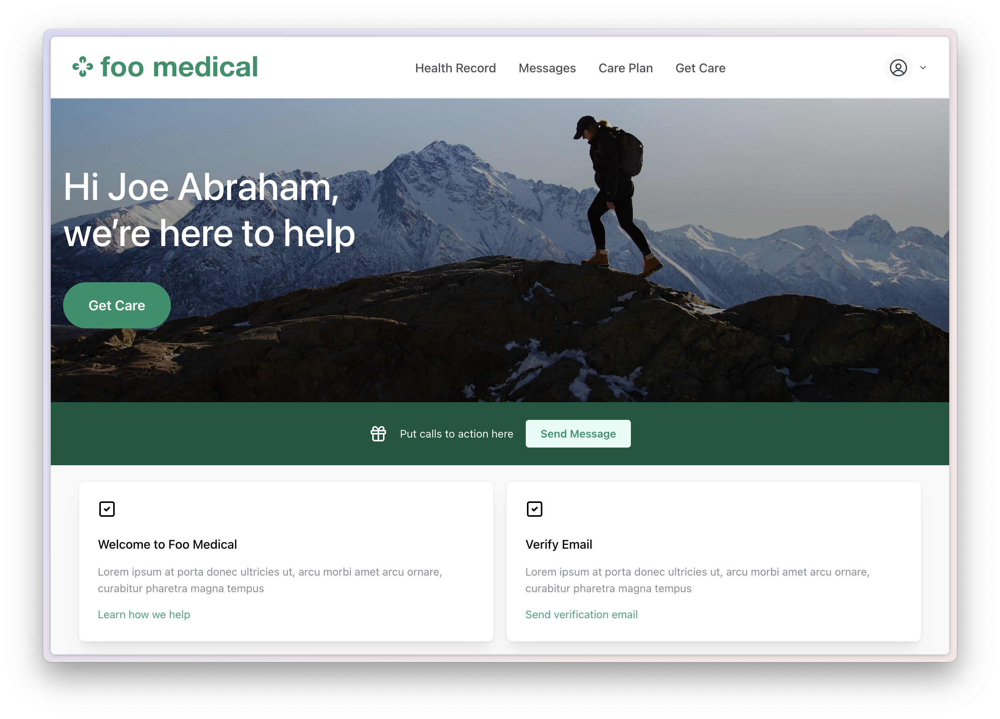

# Ovok Medical Dashboard



## Register with Ovok

1. [Register](https://dashboard.dev.ovok.com/register) your account on Ovok.

2. [Sign in](https://dashboard.dev.ovok.com/signin) to the Ovok dashboard with your email and password.

3. Go to [Overview](https://dashboard.dev.ovok.com/developer) and create a new client by clicking on the **Create new client** text.

4. Input a client name (optionally a description and redirect URI) and click the **Create Client** button.

5. Go to [ClientApplication](https://dashboard.dev.ovok.com/ClientApplication), click on the newly created client, and copy the client `ID`.

6. Go to [Project](https://dashboard.dev.ovok.com/admin/project), click on the **Details** tab and copy the project `ID`.

## Clone repository

1. Clone this repository to your local machine:

   ```bash
   git clone https://github.com/Ovok-User/medical-dashboard.git

   cd medical-dashboard
   ```

2. Install dependencies:

   ```bash
   npm install
   ```

## Edit `config.ts`

Open and edit `src/config.ts` file.

```js
export const MEDPLUM_PROJECT_ID = '9602358d-eeb0-4de8-bccf-e2438b5c9162'; // Replave with your Ovok project ID
export const MEDPLUM_CLIENT_ID = '9a872963-ab54-42da-a5bb-0bf29c5529ee'; // Replace with Ovok client ID
export const MEDPLUM_GOOGLE_CLIENT_ID = '679052511930-8dqur4mmg8egbttgos5pmr4ljtf3etbb.apps.googleusercontent.com'; 
export const MEDPLUM_RECAPTCHA_SITE_KEY = '6LfFd_8gAAAAAOCVrZQ_aF2CN5b7s91NEYIu5GxL';
```

Ensure to replace the above keys with your own project-specific values:

- `MEDPLUM_PROJECT_ID`: Ovok project ID.
- `MEDPLUM_CLIENT_ID` : Ovok client ID.
- `MEDPLUM_GOOGLE_CLIENT_ID`: For Google Client ID, you need to get `Client ID` and `Client Secret` from the Google developer console to enable sign-in from your Google account. Please go [here](https://developers.google.com/identity/oauth2/web/guides/get-google-api-clientid) to set up and add authorized URLs.
- `MEDPLUM_RECAPTCHA_SITE_KEY`: For the recaptcha site key, you can also set it up from a Google developer console.

## Create Project Sites Configuration

Go to Ovok Dashboard and add a new [project site](https://dashboard.dev.ovok.com/admin/sites) configuration. Make sure to fill in all these fields to enable the Google account sign-in and recaptcha feature:

- Google Client ID
- Google Client Secret
- Recaptcha Site Key
- Recaptcha Secret Key

## Run Medical Dashboard Demo

To run the demo:

```bash
npm run dev
```